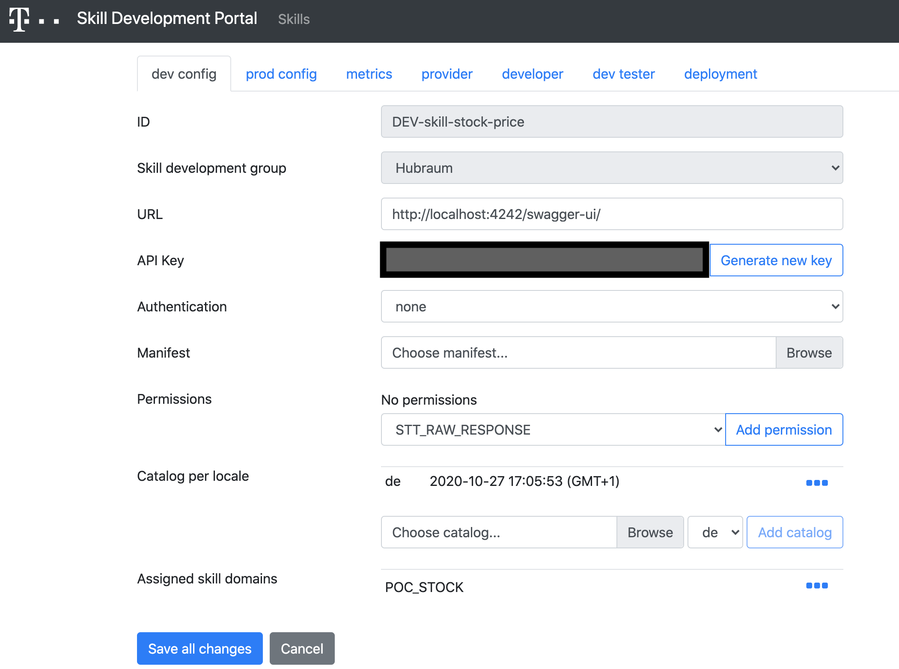

# Skill Development

This phase shows the main activities of the skill *backend development process*. The skill developer is free to decide, which development tools they would like to use for development. However, using the Magenta Voice Skill Software Development Kit (Skill SDK) is recommended.

## Magenta Voice Skill Software Development Kit (Voice Skill SDK)

The Magenta Voice Skill SDK for Python is a package that assists in creating skill implementations for the Voice Application Voice assistant used by the Magenta smart speakers.

[Here](../intro.md) is an overview of the same.

Using Skill SDK, you can create skills from two types of skill domains - Global Skill Domains and Custom Skill Domains.

* Global skill domains: This can be a user request that fulfils a similar request already existing in the Global skill domains. Here, what are the requests that skill is supposed to be handling is defined, you define how the skill should behave.
* Custom skill domains: This can be any user request that you want your skill to fulfill. In here, you define what the skill is supposed to do. Note: Whatever is not existing in the current Global skill domains, you can use a Custom skill domain.

### Developing a demo skill

[This example](../articles/demo_skill.md) takes you on a journey of how you can develop your own implementation of the skill micro-service locally and start the server.

### Skill Skeleton

Now that you have checked out how to create a demo skill, let's look at the file structure of any skill and the various components of the skill implementation [here](../skill_structure.md).

### Developing a weather skill

The detailed documentation for developing the backend for a new weather skill and deploying it locally can be found [here](../articles/weather_skill.md). *Note* that while you're developing the aforementioned weather skill, you need to keep in mind the following:
* To have the boiler plate code automatically generated while using Magenta Voice SDK, you need a skill domain context metadata json file for domain you are creating your skill in.
* As an example, this is how a context metadata json file looks like [this](config_jsons/weather_domain_metadata_prod_tenant_my_vpc.json). It is the same file referred to as the skill-weather-de-22.json in the documentation of weather skill article.
* As the name and content suggests, the file contains metadata information about the skill domain like intents supported, NLU model, entities etc.

To develop any skill from scratch you can use the SDK with the below command. Similar to the demo skill development, we also create the skill-skeleton as below.

`skill-sdk-python$ python setup.py new_skill`

## Testing the skill locally

* [Writing Unit/Functional Tests](../howtos/testing.md)
* Testing the skill implementation APIs with the local deployment, [here](../running.md) is how you can do it.

## CLI Testing

Check the command line testing tool repository [here](https://github.com/telekom/voice-cli).

## Configuring Skill on SDP

To make your skill work with the speaker, you have to do the following steps. *Recommendation*: Try out the speaker before developing your own skill. ;-)

### Getting your companion app (user) nickname from the Hallo Magenta App

Go to the HalloMagenta application on your smartphone —> mehr —> Hilfe & Infos  — > App-version —> tap on it 7 times to get your nickname.

### Adding a Skill Tester to your skill on SDP

Add a skill tester with your nickname displayed on your App. You should add your identity (your name/email) in the description.

### Configuring the skill parameters in development environment

* In the dev config tab of SDP's specific skill page, Skill Developer configures the deployed link of the skill, assigned skill domain, generates api key for the micro-service, catalog for Hallo Magenta! app (companion app), etc.
* To be able to help with CVI related configurations, send an email to the Magenta Admin with the following information:
    * Assigning the right Voice Processing Profile/Voice Processing Chain: Your User ID (or nickname) for the admin to change your Voice Processing Profile. The whole voice processing chain is defined in a profile. This is only necessary if you as a Skill Developer and Provider developing the skill and configuring it for the first time in SDP.
    * Custom skill domains: If you’re building a new functionality with custom skill domain, you need a new domain to assign the same to your skill.
    * New intents & utterances: If you need a new intent name and/or an utterance (e.g. for a weather skill a possible utterance could be `"Hallo Magenta, wie is der Wetter?"`)

### Adding a Catalogue to your Skill for the companion app

If there are multiple skills implemented for the same set of intents, one needs to choose between the preferred skill from the companion app.
* Here is a [detailed documentation](../catalog.md) on Catalog json.
* You can download a template (JSON) for the Catalog [here](config_jsons/crypto_catalog_de.json). You can change the display name & description before uploading it as per your skill.

## Further Information

Here is further information on different helpers functions provided by SDK for the development of your skill.

* [Kubernetes Integration](../k8s.md)

* [Making HTTP requests to third party services](../howtos/make_http_requests.md)

* [Circuit Breakers and Tracing](../tracing.md)

* [Caching for improved performance](../howtos/cache_stuff.md)

* [Using Docker Compose to run the skill locally](../howtos/local_services.md)
