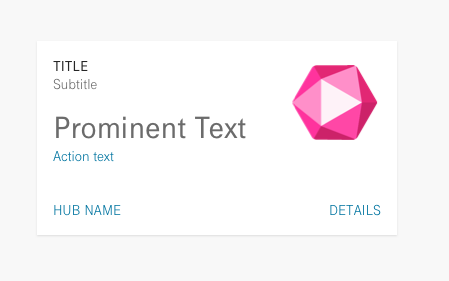
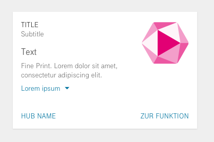

# Responses

An intent handler is supposed to return a response to the user. A response may be a simple text, 
a question expecting answer from the user. More complicated responses may present a companion app's (cApp) [card](#Cards),
invoke [client kits](use_kits_and_actions.md) (such as playing a sound stream or setting an alarm),
or schedule a [client task](client_tasks.md) execution (programmatically invoke other intents).


Valid response is an object of `skill_sdk.responses.Response` class. 

> As a shorthand, you can also send simple text string as response. It will be converted to Response object.

## `skill_sdk.responses.Response`

Skill response consists of a text to be read out and response type (specifies if user answer is expected).
Optionally it may contain a card, push notification, session storage and result data.

`Response` class has the following attributes:

- **text**: Text message that client reads out to the user. If the text is wrapped in a `<speak>` tag, it is interpreted as SSML.
- **type**: Response type. Valid response types are `skill_sdk.responses.RESPONSE_TYPE_TELL` (utter the text and end the session), 
  `skill_sdk.responses.RESPONSE_TYPE_ASK` (utter the text and wait for a user answer), 
  and `skill_sdk.responses.RESPONSE_TYPE_ASK_FREETEXT` (utter the text and wait for a user answer in free format).
- **card**: Response card. The card is sent to a user's companion app on a mobile device.
- **push_notification**: Push notification. The notification to send to the device. 
- **session**: Session attributes. Preliminary skill state storage that is kept until `RESPONSE_TYPE_TELL` ends the session. 
- **result**: Additional storage used for debug info, [client kits](use_kits_and_actions.md) activation 
  and delayed [client tasks](client_tasks.md) execution.  

### Cards

Action cards deliver additional information to the user via the companion app on a smartphone.
A card is a graphical representation of a successful voice commands invoke.

#### Card Elements

Below is a list of card elements with their field names and descriptions. 
To get a better idea of field positions and their design, please refer to the samples section.

| Field |  Description  |
| -------- | ----------| 
|title_text | **Title**: this text is displayed as card title. If the filed is missing, the name of the related skill is displayed as card title. If the related skill is missing the title view is hidden.          
|type_description  | **Subtitle**: card subtitle. If the filed is missing, the subtitle view is hidden.   |
|prominent_text  | **Prominent Text**: card prominent text. If the filed is missing, the prominent text view is hidden.
|text  |  **Text**: card text. If the filed is missing, the text view is hidden.
|sub_text  |  **Subtext**: card subtext. If the filed is missing, the subtext view is hidden.
|icon_url  |  **Icon URL**: image that should be displayed inside the card view. Can be a valid url of an image e.g. cloudimage://picture.service/. If empty - a normal skill icon will be displayed as a fallback. If the skill is unknown, the image view will be hidden.
|list_sections  |  **List Sections**: a card can have a bullet-like list. Each list section contains items and title, title is optional. Each item contains iconUrl and title and iconUrl is optional.

Actions:

| Field |  Description  |
| -------- | ----------| 
|action  |  **Action**: action URL linked to action text or action prominent text. can be one of the internal deep links or an external url to a website. 
|action_text  |  **Action Text**: link text to access the given action. If the filed is missing, the link view is hidden. 
|action_prominent_text  |  **Action Prominent Text**: link prominent text to access the given action. f the filed is missing, the prominent link view is hidden.
#### Samples

- Sample card with title, subtitle, text and sub-text:
```python
from skill_sdk import Response
response = Response().with_card(
    title_text='Title',
    type_description='Subtitle',
    text='Text',
    sub_text='Subtext'
)
```


- Prominent Text with link action:

```python
from skill_sdk import Response
response = Response().with_card(
    title_text='Title',
    type_description='Subtitle',
    prominent_text='Prominent Text',
    action='https://me-website',
    action_text='Action text'
)
```


- Expandable list:

```python
from skill_sdk.responses import Response, ListSection, ListItem
response = Response().with_card(
    title_text='Title',
    type_description='Subtitle',
    text='Text',
    sub_text='Fine Print. Lorem dolor sit amet, consectetur adipiscing elit.',
    list_sections=[
        ListSection('Item Title', [
            ListItem('List item 1', 'cloudimage://picture.service/...'),
            ListItem('List item 2', 'cloudimage://picture.service/...')
        ]),
        ListSection('Item Title', [
            ListItem('List item 1', 'cloudimage://picture.service/...'),
            ListItem('List item 2', 'cloudimage://picture.service/...')
        ]),
        ListSection('Item Title', [
            ListItem('List item 1', 'cloudimage://picture.service/...'),
            ListItem('List item 2', 'cloudimage://picture.service/...')
        ]),
    ]
)
```



## Re-prompts

A re-prompt response is a special type of `RESPONSE_TYPE_ASK` response. It is implemented as a measure to limit a number of re-prompts.

Suppose your skill receives a number that must be in a range between 1 and 10. 
If user answers with a number outside a range, you want to issue a re-prompt notifying user about erroneous input. 
If user again answers with a number outside, you issue a re-prompt once again.
If user's input is again invalid, you might want to give up and stop re-prompting.  

`Reprompt` response sets a number of re-prompts as a session value, increasing it with every prompt to user.
When the number of re-prompts reaches maximum, a simple `RESPONSE_TYPE_TELL` is returned with a `stop_text` that is set when creating an instance of `Reprompt` response.  

## ErrorResponse

*`skill_sdk.responses.ErrorResponse`*

An intent handler can return an `ErrorResponse` explicitly. 
If intent handler fails with exception, the SDK will implicitly return `ErrorResponse` object.

The following combinations of an `ErrorResponse` are defined:

- **wrong intent**: `ErrorResponse(code=1, text="intent not found")` → *HTTP code: 404*
- **invalid token**: `ErrorResponse(code=2, text="invalid token")` → *HTTP code: 400*
- **bad request**: `ErrorResponse(code=3, text="Bad request")` → *HTTP code: 400*
- **unhandled exception**: `ErrorResponse(code=999, text="internal error")` → *HTTP code: 500*
